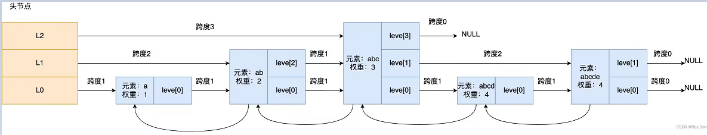
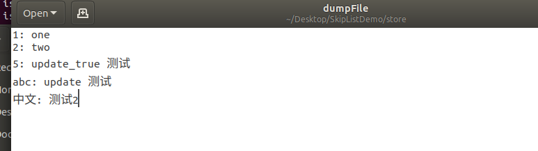

# 基于跳表实现的K-V存储引擎

## 前言

项目学习自：

- https://github.com/youngyangyang04/Skiplist-CPP

- https://github.com/czGitAccount/SkipList

## 项目介绍

**项目说明**：基于 **跳表** 实现的 K - V 存储引擎，使用 C++ 实现。

**跳表原理图**：



【补充】图片取自：CSDN 作者：Ray Song

**函数功能实现**：

- insert_element 插入数据
- delete_element 删除数据
- search_element 查询数据
- update_element 更新数据 
- display_list 打印跳跃表
- dump_file 数据落盘
- load_file 加载数据
- size 返回数据规模
- clear 清空跳表 


## 项目测试

>  **简单测试**

测试`SkipList.h`和`main.cpp`的命令：`g++  main.cpp -o ./bin/main  -fpermissive`

项目测试结果：

```bash
--- insert 测试 ---
Successfully inserted key: 1, value:  one
Successfully inserted key: 2, value:  two
Successfully inserted key: 3, value:  three
Successfully inserted key: abc, value:  测试1
Successfully inserted key: 中文, value:  测试2
skipList size after insert_element(): 5
--- search 测试 ---
search_element...
Found key: 3, value:  three
search_element...
Found key: 中文, value:  测试2
search_element...
Not Found Key: 4
--- delete 测试 ---
Successfully deleted key : 3
5 is not exist, please check your input !
skipList size after delete_element(): 4
--- update 测试 ---
key: abc, exists
old value :  测试1 --> new value :  update 测试
5 is not exist, please check your input !
Successfully inserted key: 5, value:  update_true 测试
skipList size after update_element(): 5
--- dump_file 测试 ---
dump_file...
1: one;
2: two;
5: update_true 测试;
abc: update 测试;
中文: 测试2;
--- display 测试 ---

******** Skip List ********
Level 0: 1: one;2: two;5: update_true 测试;abc: update 测试;中文: 测试2;
Level 1: 1: one;2: two;5: update_true 测试;abc: update 测试;中文: 测试2;
Level 2: 1: one;2: two;5: update_true 测试;abc: update 测试;中文: 测试2;
Level 3: 2: two;5: update_true 测试;abc: update 测试;
Level 4: 2: two;
Level 5: 2: two;
--- clear 测试 ---
clear ...
skipList size after clear(): 0
--- load_file 测试 ---
load_file...
Successfully inserted key: 1, value:  one
key:1value: one
Successfully inserted key: 2, value:  two
key:2value: two
Successfully inserted key: 5, value:  update_true 测试
key:5value: update_true 测试
Successfully inserted key: abc, value:  update 测试
key:abcvalue: update 测试
Successfully inserted key: 中文, value:  测试2
key:中文value: 测试2
skipList size after load_file(): 5

******** Skip List ********
Level 0: 1: one;2: two;5: update_true 测试;abc: update 测试;中文: 测试2;
Level 1: 1: one;2: two;5: update_true 测试;abc: update 测试;中文: 测试2;
Level 2: 中文: 测试2;
```

注意：

- 数量落盘存储K-V键值对。



- 数据加载是按照落盘文件中的键值对重新进行 `insert` 操作。

> **压力测试**

使用多线程对跳表的增删改查的功能进行测试。

**测试方法：**

```bash
penge@penge-virtual-machine:~/Desktop/SkipListDemo$ ./stress_test_start.sh 
```

这里设置跳表的高为18，采用随机插入数据，将测试数据保存在`stress_test`文件夹中的`test_result`文件下。

**具体代码**：`stress_test.cpp`

**测试结果**：`test_result`

```
TEST_COUNT : 1000000 NUM_THREADS: 1
insert elapsed: 6.37592
update elapsed: 8.86065
get elapsed: 9.14877
delete elapsed: 7.03448
```

